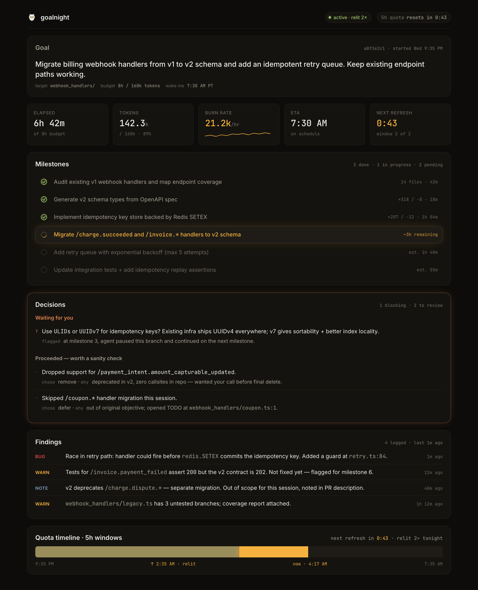
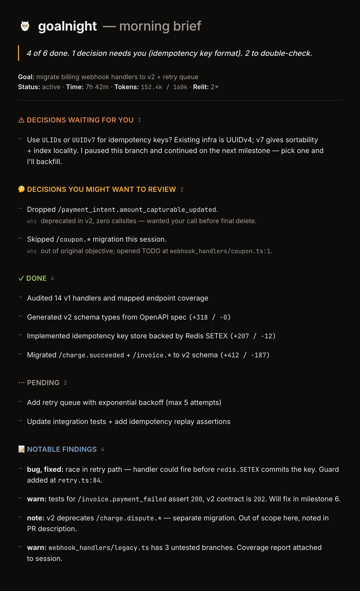
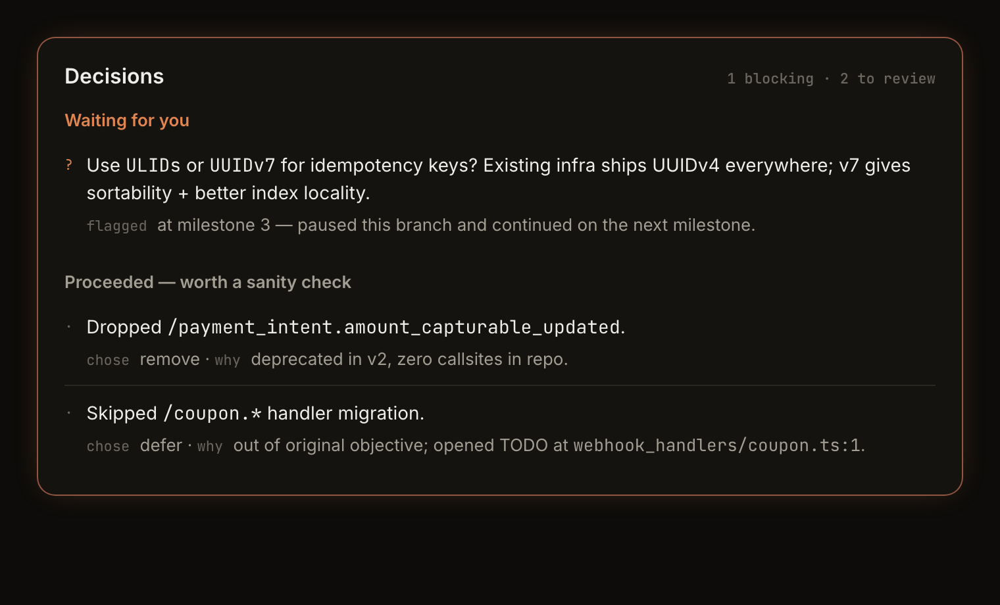
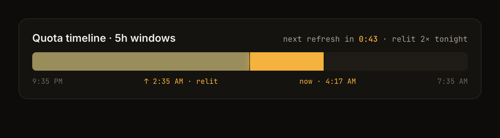

# 🌙 goalnight

> **set a goal, go to bed, wake up to a PR.**



Codex `/goal` is great. But when it hits your 5h token quota, it just stops.
You sleep 8h. Your tokens refresh at hour 5. They sit there. They expire.

**goalnight** is an open-source Codex plugin that:

- 🌙 calculates how much token budget your sleep can afford
- 🔄 auto-resumes when quota refreshes (across multiple 5h periods)
- 📢 wakes you with a notification only when something actually needs you
- ☀️ shows you a morning brief: what shipped, what's blocked, what needs your call
- 📊 displays a cozy localhost dashboard so you can peek any time

---

## Why this exists

OpenAI sells subscriptions. Their incentive isn't to help you drain them. Like a gym: the less you show up, the better the unit economics.

So official `/goal` doesn't go out of its way to squeeze your quota dry. The engineering is solid, but a few things they *structurally* won't do:

- they won't compute how much token budget your sleep window can afford
- they won't relight the task the second your quota refreshes at 3am
- they won't hand you a morning brief that's actually three seconds to read

You already paid for the tokens. There's no good reason 3 of your 8 sleeping hours should be quota evaporating into the dark.

That's the gap goalnight fills.

---

## Install

One-liner (recommended):

```bash
curl -fsSL https://raw.githubusercontent.com/Edward4226/goalnight/main/install.sh | sh
```

What it does:

1. `codex plugin marketplace add Edward4226/goalnight`
2. `npm install` inside the cached plugin directory
3. Enables `plugin_hooks = true` in `~/.codex/config.toml`
4. On macOS, installs the launchd auto-resume watcher (dry-run by default)

Requirements: Codex CLI (`npm install -g @openai/codex`), Node ≥ 18, macOS for v0.1.

> **Heads-up — auto-resume is dry-run by default.** After install, the watcher
> only logs what it *would* do. To enable real `codex exec resume` calls when
> your quota refreshes overnight, edit
> `~/Library/LaunchAgents/dev.goalnight.watcher.plist`, change
> `GOALNIGHT_WATCHER_RESUME` from `"0"` to `"1"`, then
> `launchctl unload <plist> && launchctl load <plist>`. The install script
> prints these exact commands at the end.

---

## Use

Before bed, inside a Codex session:

```text
@goalnight plan 8h to implement user-profile feature with tests
```

In the morning:

```text
@goalnight brief
```

Peek any time at `http://localhost:8888`.

---

## What it does (under the hood)

**🌙 Sleep Budget Algorithm.** Converts your sleep window into a token budget and a milestone count — so the model knows when to push and when to wrap up.

**🔄 Cross-Period Auto-Resume.** A small launchd watcher polls Codex's usage state (sqlite + rollout JSONL). The instant your 5h quota refreshes, it calls `codex exec resume <session-id>` and re-injects context. No 3am intervention.

**📢 Pause / Approval Notifications.** macOS desktop notifications fire only on the things that actually need you — blocking decisions, quota hits, approval waits, goal complete. Throttled so a chatty session doesn't spam you.

**☀️ Morning Brief.** `@goalnight brief` (or `gn brief`) renders a one-page summary: what shipped, token spend, decisions waiting, suggested next steps. Designed to read in 30 seconds.



**🤝 Decisions Awaiting.** When the model would normally ask "should I do A or B?", it instead records the question, its recommendation, and its reasoning — then proceeds. You review in the morning brief, override if you disagree.



**📊 Quota timeline.** The dashboard shows you exactly where you are in the 5h window, how many windows you've already relit, and when the next refresh hits.



---

## Limitations (v0.1)

A few things to know before you trust it overnight:

- **Hooks fire in interactive `codex` sessions only.** `codex exec` (the non-interactive mode) does not currently invoke plugin hooks in codex 0.130.0 (`plugin_hooks` is still tagged "under development" in `codex features list`). That means goalnight's notifications and live state tracking only work when you're inside a real `codex` session — not when you script it via `codex exec`.
- **Auto-resume is dry-run by default.** The watcher logs what it *would* do, but doesn't actually call `codex exec resume` until you flip `GOALNIGHT_WATCHER_RESUME` to `"1"` in the launchd plist. We default-off on purpose — we'd rather you opt in than wake up to surprise token spend.
- **Single-session model.** v0.1 assumes one goalnight session at a time. If you start a second one while the first is active, the dashboard and morning brief will show the most recent.
- **State detection is best-effort.** The stop hook reads `payload.goal_state` from codex's hook payload. The exact field name in codex 0.130.0 hasn't been confirmed against a live session — if you see decisions/findings landing but no transition notifications firing, please file an issue with a stop-hook stdin dump.
- **macOS only.** Linux + Windows are v0.2. The watcher uses `launchd`; cross-platform support needs systemd / scheduled-task equivalents.

---

## Requirements

- Codex CLI installed (`npm install -g @openai/codex`)
- Node.js ≥ 18
- macOS (v0.1; Linux/Windows in v0.2)

---

## Status

**v0.1**: pre-alpha. macOS only. Read-only dashboard. The auto-resume watcher ships in dry-run mode by default — flip the env var when you're ready to trust it overnight.

Roadmap is coming after v0.1: cross-platform notifications, Linux/Windows watchers, dashboard interactions, optional checkpoint/rollback for milestones.

---

## Contributing

Bug reports welcome. Feature requests — please skim [docs/positioning.md](docs/positioning.md) first so we can stay aligned on what goalnight is and isn't.

---

## License

[AGPL-3.0](LICENSE). If you're building a hosted service on top of goalnight, the AGPL applies — happy to talk about a commercial license if that's a blocker for you.

---

🦉 *Built by someone tired of watching token quotas evaporate overnight.*
